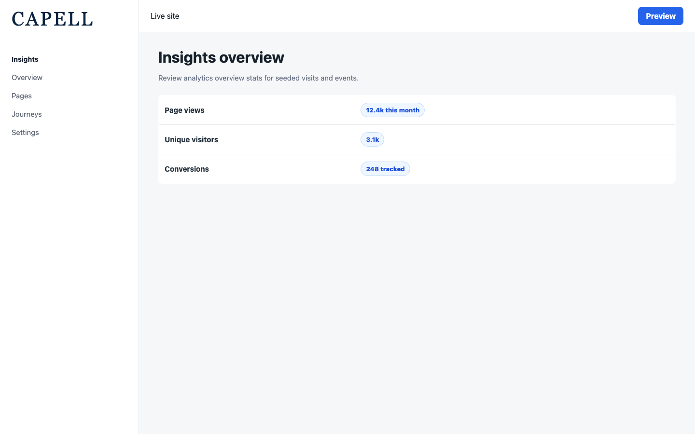
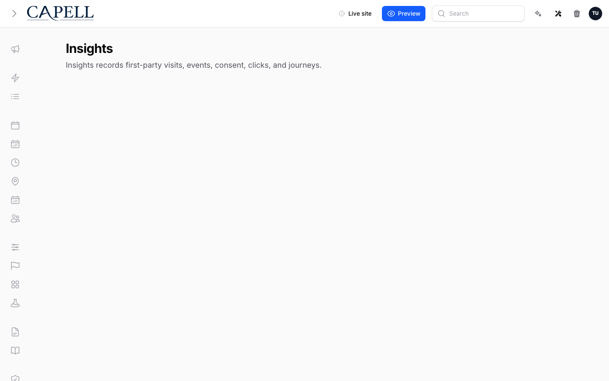
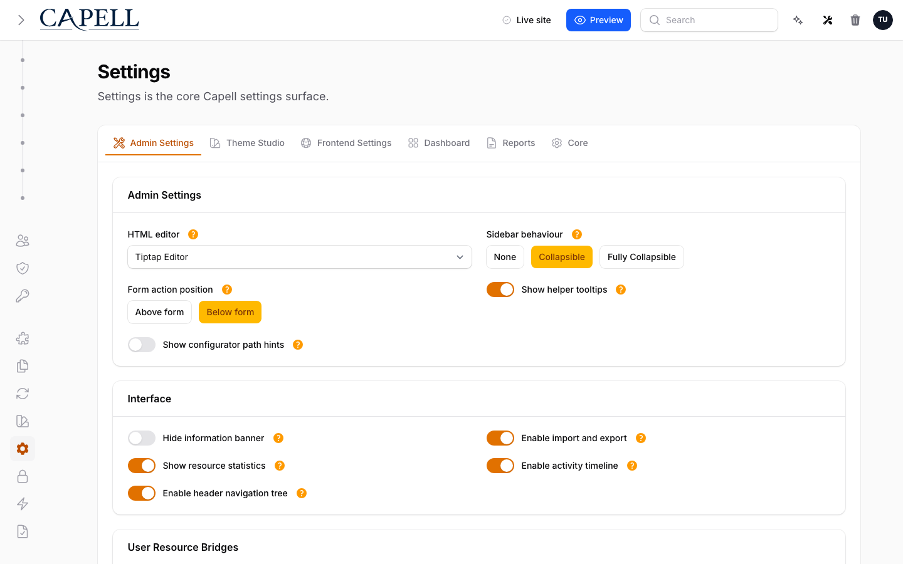
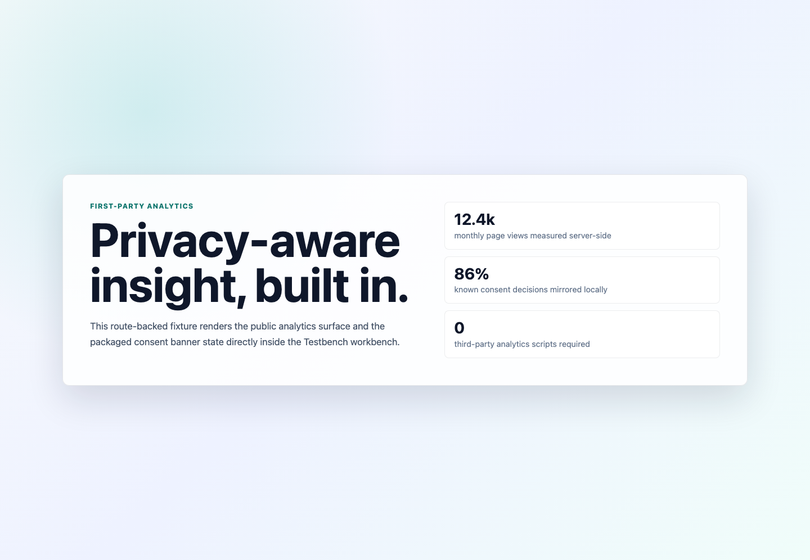
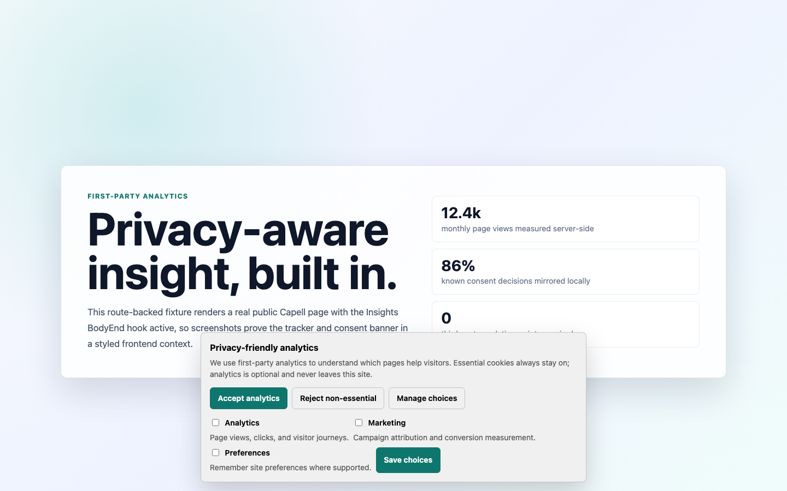

# Insights

<!-- prettier-ignore-start -->

## What This Plugin Adds

Insights is an **Available**, **Schema-owning** Capell package in the **Capell Growth** product group. It ships as `capell-app/insights` and extends these surfaces: admin, frontend.

Cookie-light, GDPR-aware web analytics built into your Capell admin - page views, clicks, visitor journeys, and consent, with no third-party scripts and no data leaving your server.

After install, admins get package-owned management surfaces and public users may see package-owned frontend output or routes.

Status details:

- Status: Available
- Tier: premium
- Bundle: growth
- Composer package: `capell-app/insights`
- Namespace: `Capell\Insights`
- Theme key: not applicable

## Why It Matters

**For developers:** The package gives developers package-owned service providers, Actions, Data objects, models, Laravel routes, Filament classes, and Blade views instead of pushing this behaviour into core or application code.

**For teams:** Cookie-light, GDPR-aware web analytics built into your Capell admin - page views, clicks, visitor journeys, and consent, with no third-party scripts and no data leaving your server.

## Screens And Workflow

Screenshot contract: `screenshots.json`.

- Insights overview dashboard widgets (admin, required).
- Popular pages widget (admin, required).
- Recent journeys widget (admin, required).
- Insights settings screen (admin, required).
- Frontend page with tracker active (frontend, optional).
- Consent banner flow (frontend, optional).

## Screenshot Evidence

These captures are the package-owned visual contract for the admin pages, public pages, actions, workflows, and feature surfaces described above. Keep this section aligned with `docs/screenshots.json` whenever the package surface changes.

### Insights overview dashboard widgets

- Surface: admin · Target: admin-surface.
- Documents: An administrator reviews analytics overview stats for seeded visits and events.
- Capture notes: Capture after installing capell-app/insights in the isolated demo harness and seeding the data required for this use case.

### Popular pages widget

- Surface: admin · Target: admin-surface.
- Documents: An administrator identifies high-traffic pages from seeded page-view data.
- Capture notes: Capture after installing capell-app/insights in the isolated demo harness and seeding the data required for this use case.

### Recent journeys widget

- Surface: admin · Target: admin-surface.
- Documents: An administrator follows recent visitor journeys across pages and events.
- Capture notes: Capture after installing capell-app/insights in the isolated demo harness and seeding the data required for this use case.

### Insights settings screen

- Surface: admin · Target: admin-surface.
- Documents: A site owner configures tracking, consent, retention, and beacon behavior.
- Capture notes: Capture after installing capell-app/insights in the isolated demo harness and seeding the data required for this use case.

### Frontend page with tracker active

- Surface: frontend · Target: frontend-url.
- Documents: A visitor loads a public page where the tracker script is active and consent rules are respected.
- Capture notes: Capture through the Insights package-owned public fixture route, which is enabled only for screenshot runs and renders the real BodyEnd hook output.

### Consent banner flow

- Surface: frontend · Target: frontend-url.
- Documents: A first-time visitor reviews the packaged accept, reject, and manage choices before analytics tracking begins.
- Capture notes: Capture through the Insights package-owned public fixture route in a fresh browser context with no capell_insights_consent localStorage entry and no capell_insights_visit cookie. The route forces the packaged consent banner on for this screen.

## Technical Shape

- Service providers: `Capell\Insights\Providers\InsightsServiceProvider`, `Capell\Insights\Providers\AdminServiceProvider`.
- Config files: `packages/insights/config/capell-insights.php`.
- Migrations: `packages/insights/database/migrations/2026_05_10_190855_01_create_insights_visits_table.php`, `packages/insights/database/migrations/2026_05_10_190855_02_create_insights_consents_table.php`, `packages/insights/database/migrations/2026_05_10_190855_03_create_insights_events_table.php`, `packages/insights/database/migrations/2026_05_10_190855_05_import_legacy_page_views.php`, `packages/insights/database/migrations/2026_06_06_000001_create_insights_daily_rollups_table.php`.
- Settings migrations: `packages/insights/database/settings/2026_05_10_190856_01_create_insights_settings.php`, `packages/insights/database/settings/2026_06_14_000001_rename_insights_form_tracking_setting.php`.
- Settings classes: `InsightsSettings`, `InsightsSettingsMigrationProvider`.
- Models: `InsightsConsent`, `InsightsDailyRollup`, `InsightsEvent`, `InsightsVisit`.
- Filament classes: `InsightsPage`, `InsightsDashboardSettingsContributor`, `InsightsSettingsSchema`, `AcquisitionSourcesWidget`, `BuildsInsightsDashboardWindow`, `InsightsOverviewStatsWidget`, `LiveInsightsStatsWidget`, `PopularPagesWidget`, `RecentJourneysWidget`, `TopActionsWidget`, `TrendingPagesWidget`.
- Route files: `packages/insights/routes/web.php`.
- Actions: `BuildAcquisitionSourcesQueryAction`, `BuildFunnelConversionReportAction`, `BuildInsightsDigestAction`, `BuildInsightsOverviewStatsAction`, `BuildJourneyTimelineAction`, `BuildLiveInsightsStatsAction`, `BuildPopularPagesQueryAction`, `BuildRecentJourneysQueryAction`, `BuildTopActionsQueryAction`, `BuildTrendingPagesQueryAction`, `CreateInsightsVisitAction`, `ExportInsightsDigestCsvAction`, `and 16 more`.
- Data objects: `InsightsBeaconData`, `InsightsConsentData`, `InsightsDigestData`, `InsightsEventData`, `InsightsEventMetadataData`, `InsightsJourneyStepData`, `InsightsPageSummaryData`, `InsightsVisitData`, `InsightsWindowData`.
- Console command classes: `PurgeInsightsDataCommand`, `RebuildInsightsDailyRollupsCommand`.
- Health checks: `Capell\Insights\Health\InsightsHealthCheck`.
- Blade views: `packages/insights/resources/views/components/consent-banner.blade.php`, `packages/insights/resources/views/filament/pages/insights.blade.php`, `packages/insights/resources/views/tracker.blade.php`.
- Cache tags: `insights`.

## Data Model

- Required tables: `insights_visits`, `insights_consents`, `insights_events`, `insights_daily_rollups`.
- Models: `InsightsConsent`, `InsightsDailyRollup`, `InsightsEvent`, `InsightsVisit`.
- Migration files: `2026_05_10_190855_01_create_insights_visits_table.php`, `2026_05_10_190855_02_create_insights_consents_table.php`, `2026_05_10_190855_03_create_insights_events_table.php`, `2026_05_10_190855_05_import_legacy_page_views.php`, `2026_06_06_000001_create_insights_daily_rollups_table.php`.
- Migration impact: run host migrations through the package install flow before opening package surfaces.
- Deletion/retention behaviour: `insights:purge` removes events, consents, and eligible visits older than the configured retention window in batches. `insights:rollups:rebuild` maintains daily aggregate rows for long-range page reports.

## Install Impact

- Admin navigation: adds package-owned Filament classes when registered.
- Permissions: `View:InsightsPage`.
- Public routes: route files exist and must be reviewed before public enablement.
- Database changes: package migrations are declared.
- Settings: `Capell\Insights\Settings\InsightsSettings`.
- Queues or schedules: `insights:purge` is scheduled monthly and `insights:rollups:rebuild` is scheduled daily by the admin provider.
- Cache tags: `insights`.
- Commands: console command classes detected: `PurgeInsightsDataCommand`, `RebuildInsightsDailyRollupsCommand`.

## Common Pitfalls

- Run migrations before opening package resources or public routes.
- Configure package settings before testing production-like workflows.
- Review route middleware, throttling, signed URLs, and public-output safety before exposing routes.
- Keep public Blade and cached HTML free of authoring markers, model IDs, permissions, signed editor URLs, and lazy database queries.
- Keep `composer.json`, `composer.local.json`, `capell.json`, docs, screenshots, and tests aligned when the package surface changes.

## Troubleshooting

| Symptom | Likely cause | Check | Fix |
| --- | --- | --- | --- |
| Package surface is missing after install | Provider or manifest is not loaded | Confirm `capell.json`, package `composer.json`, and provider registration | Reinstall the package, refresh Composer autoload, and clear host caches |
| Admin screen or command fails on missing table | Package migrations have not run | Check the tables listed in `Data Model` | Run host migrations and rerun the focused package test |
| Route returns unexpected output | Route cache, middleware, or signed URL setup does not match the package route file | Check the route files listed in `Technical Shape` | Clear route cache and verify middleware before exposing public routes |
| Public output leaks unexpected state | Render data, cache variation, or authoring boundary has regressed | Check public Blade, cache tags, and public-output safety tests | Move data loading out of Blade and rerun the package public-output tests |

## Quick Start

1. Install the package: `composer require capell-app/insights`.
2. Run the required setup: `php artisan migrate`.
3. Open the related Capell admin surface and verify Insights appears.

## Next Steps

- [Package docs index](README.md)
- [Screenshot contract](screenshots.json)
- [Marketplace assets](assets/marketplace/)
- [Capell content language plan](../../../docs/CONTENT_LANGUAGE_PLAN.md)
- [Capell documentation design system](../../../docs/DESIGN_SYSTEM.md)
- [Capell and package ERD notes](../../../docs/erd/capell-and-package-erds.md)
- Related packages: [Privacy Center](../../privacy-center/README.md).
- Focused tests: `vendor/bin/pest packages/insights/tests --configuration=phpunit.xml`.

<!-- prettier-ignore-end -->
