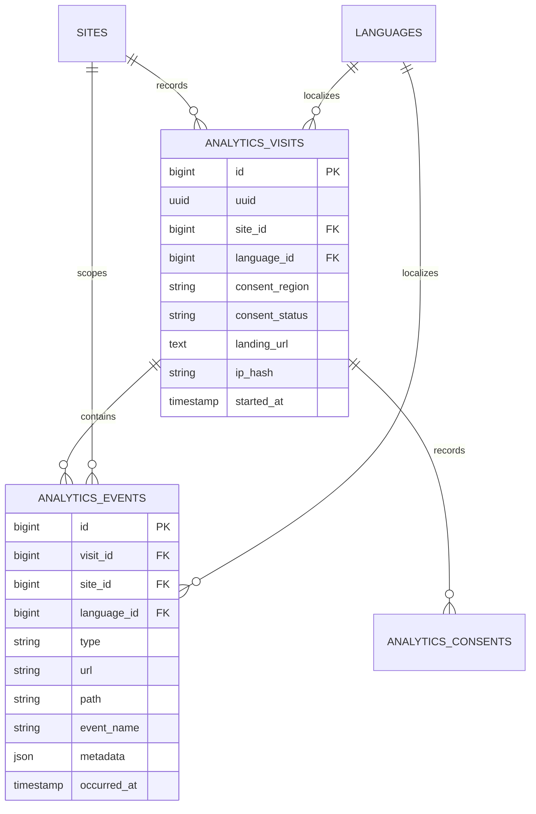

# Insights

Status: **Available, schema-owning** · Kind: **package** · Tier: **premium** · Bundle: **growth** · Contexts: **admin, frontend** · Product group: **Capell Growth**

This page is the consolidated implementation overview for the Insights package. It is extracted from the package README, service providers, migrations, config files, routes, resources, models, actions, and the shared Capell ERD notes where available.

## What This Package Adds

Insights records first-party visits, events, consent decisions, page views, clicks, and journey data for Capell sites.

- Frontend beacon endpoints for events and consent.
- Render hook that registers the tracker and overrideable consent banner.
- Dashboard widgets for overview stats, popular pages, top actions, journeys, and trending pages.
- Settings schema for insights retention and behaviour.

## Developer Notes

Keeps insights in Laravel actions and data objects, with explicit consent enums and configurable routes.

- InsightsServiceProvider and AdminServiceProvider register routes, settings, and widgets.
- Config file: capell-insights.php.
- Routes: POST capell/insights/events and POST capell/insights/consent by default.
- Models: InsightsVisit, InsightsConsent, InsightsEvent.
- Actions record page views, clicks, custom events, and consent updates.
- Acquisition reporting surfaces UTM source/medium/campaign, referrer hosts, and direct visits.
- Recording filters suppress configured bot user agents and internal IPs before creating visits or events.
- Journey recording starts a fresh visit after `session_timeout_minutes`, resetting event sequence numbers per browsing session.
- Dashboard aggregate Actions use short-TTL caching keyed by locale, window, scope, and limit.
- The packaged consent banner calls the consent endpoint for accept, reject, and granular choices.
- PurgeInsightsDataCommand supports chunked retention cleanup.
- InsightsHealthCheck verifies tables, beacon routes, tracker render output, purge scheduling, and visitor-hash secret safety.

## Operational Notes

Gives site operators practical traffic and journey insight without sending the workflow through an external dashboard first.

- Adds insights tables and settings migration.
- Adds beacon and consent public POST routes.
- Injects a theme-overridable consent banner by default; disable it with `consent_banner_enabled=false` when a host site supplies its own consent UI.
- Adds dashboard widgets and insights settings.
- Uses capell-insights config keys for route prefix, consent, hashing, dashboard cache TTL, retention, purge batch size, and ignored paths.
- Uses `ignored_user_agents` and `ignored_ips` to keep crawler, monitor, preview, and staff office traffic out of reports.
- Uses `session_timeout_minutes` to prevent returning visitors from being displayed as one long historical journey.
- Schedules monthly retention cleanup through `insights:purge`.

## Data And Retention

- insights_visits stores site, language, consent, landing URL, referrer, UTM campaign fields, hashed visitor data, and start time.
- insights_consents stores consent decisions for a visit.
- insights_events stores event type, URL, path, metadata, and occurrence time.
- Visits relate to events and consents.
- Retention is governed by retention_days, purge_batch_size, and purge actions.

## Screenshot Plan

- Insights overview dashboard widgets.
- Popular pages widget.
- Recent journeys widget.
- Insights settings screen.
- Frontend page with tracker active.

## Screenshots

Widget-specific screenshots should be regenerated after analytics demo data is seeded; empty widget captures do not add useful documentation.

## Pitfalls

- Exclude admin, Livewire, and insights routes from tracking.
- Keep `ignored_user_agents` broad enough for bots and monitors, and set `ignored_ips` for agency/staff office traffic that should not influence buyer-facing analytics.
- Leave `hash_salt` empty to derive visitor hashing from `APP_KEY`, or set a private package-specific salt before production data is recorded. Changing it later breaks visitor continuity.
- Consent regions are resolved server-side from `default_consent_region` or GeoIP; browser-submitted region values are not authoritative.
- Consent settings must match the site privacy policy.

## Verification

- Run `vendor/bin/pest packages/insights/tests` when package tests exist.
- Run the relevant host-app migration or package install flow in a disposable database.
- Open the listed admin or frontend surface and compare it with the screenshot plan.

## Package Manifest

- Composer name: `capell-app/insights`
- Product group: Capell Growth
- Kind: package
- Tier: premium
- Bundle: growth
- Contexts: `admin`, `frontend`
- Requires: `capell-app/core`, `capell-app/admin`, `capell-app/frontend`
- Optional dependencies: None listed.

## Admin Surfaces

- Extension page: `InsightsPage`.
- Dashboard widgets: overview stats, live stats, popular pages, trending pages, recent journeys, and top actions.
- Settings schema: `InsightsSettingsSchema`.
- Overview stats: page views, unique visits, and clicks.

## Commands

- `insights:purge {--days= : Override insights retention days}` (packages/insights/src/Console/Commands/PurgeInsightsDataCommand.php)

## Routes And Config

- Config: packages/insights/config/capell-insights.php
- Route file: packages/insights/routes/web.php

## Permissions And Gates

- Gate: InsightsOverviewStatsWidget: `admin`, `super_admin`
- Gate: PopularPagesWidget: `admin`, `super_admin`
- Gate: RecentJourneysWidget: `admin`, `super_admin`
- Gate: TopActionsWidget: `admin`, `super_admin`
- Gate: TrendingPagesWidget: `admin`, `super_admin`

## Migrations

- Migration: 2026_05_10_190855_01_create_insights_visits_table.php
- Migration: 2026_05_10_190855_02_create_insights_consents_table.php
- Migration: 2026_05_10_190855_03_create_insights_events_table.php
- Migration: 2026_05_10_190855_05_import_legacy_page_views.php
- Settings migration: 2026_05_10_190856_01_create_insights_settings.php

## ERD Excerpt

## Screenshot Automation

Deployment should read [screenshots.json](screenshots.json), install the package with demo data, resolve each admin surface or frontend URL, and write images to `packages/insights/docs/screenshots`.

- Insights overview dashboard widgets.
- Popular pages widget.
- Recent journeys widget.
- Insights settings screen.
- Frontend page with tracker active.
